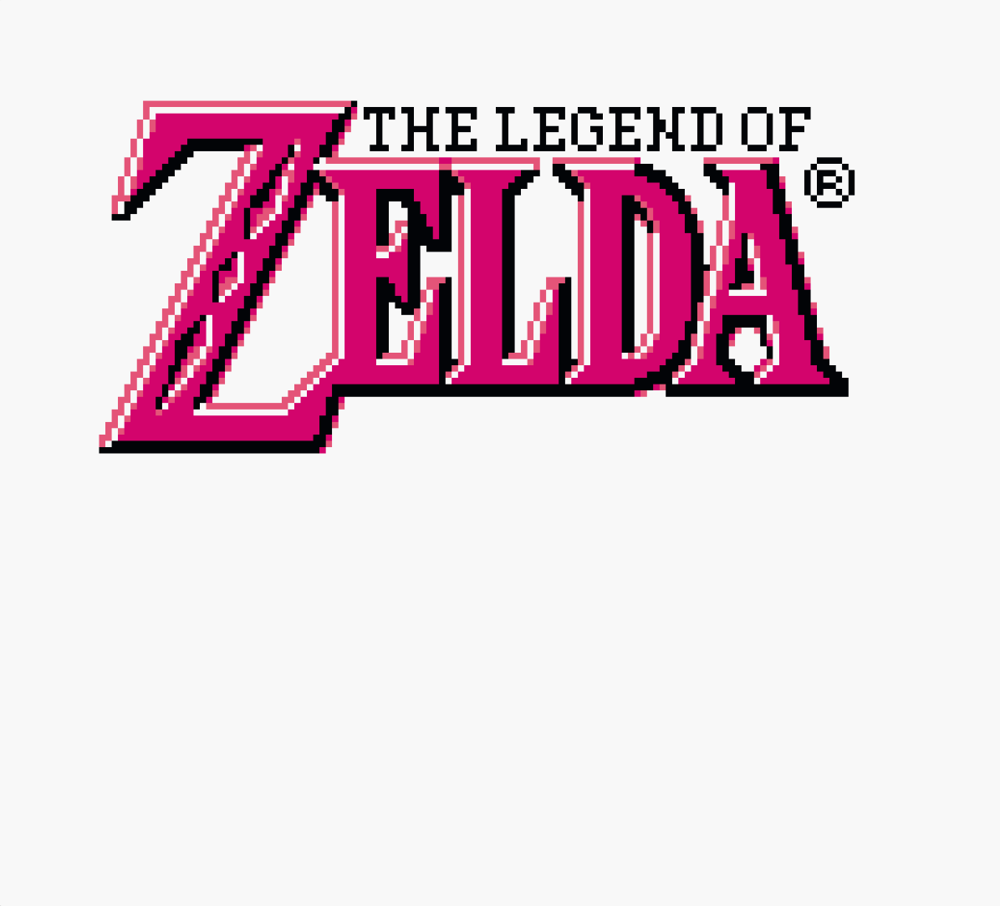

# MAGFest-2026-oot2d-rick-roll



The ROM is available at the [archive.org](https://archive.org/details/game_20260114) page! Just click `Show All` under the `Download Options` box on the right side, and you will see two files: `game.gb` and `game.gbc`. These are the ROM files you can use to experience the demo on hardware or via emulation(see [Emulation Notes](#emulation-notes)).

If you want to see what this is, here is a video: <https://youtu.be/f6blx_wpCHw>

The label was made by my good friend [Steve](https://github.com/MGZero) @ <https://bsky.app/profile/spacepiratemanga.bsky.social> - check them out!!!

For MAGFest 2026, I developed a little prank GameBoy cartridge! The
inspiration was due to the fact that we've had over 20 years of failed
OoT2D attempts. Starting with the most infamous one - Daniel Barres's
attempt, founded at ZFGC.com to a bunch of random attempts later on. If
anyone at MAGfest seen a Monokuma with a messy beard runnin around, that
was me. :) Nice to meet ya! Everyone was so nice and talkative, I loved
every second of it!

In spirit of the love of Zelda and the community, this prank was sort of
meant to memorialize the idea of OoT2D and maybe inspire some new fresh
blood to try and take a stab at demaking one of the most iconic games
of our time!

This demo also almost didn't happen because of an oops I did on my part.
I wanted to flash the carts at con, and made the mistake of not
realizing my macbook did not have enough disk space to copy over the
source files for the OoT2D Prank - and by the time I realized what had
happened, I was already on the airplane. So what you see is basically
something that was created within the flight from Cleveland to DC, in a
frantic panic. (Also shame on me for not publishing the git repository
to GitHub) The music routine thankfully came over fine, but the maps and
a lot of other things did not. Originally I had all of Kikori Forest
implemented, but now we're left with this due to my poor planning. Oh,
well. :) There's always a next time!

## Credits

Anyways, here are the credits!

```text
Coding: gm112
Epicness: MG-Zero

- Assets -

- Maku Tree -
Guille Skye
Tailikku 

    - Link -
MisterMike

   - Tilesets -
Katsu

Special Thanks:
SkyEmu
Aaron Spurling
Choco
```

## Build

Download [GB Studio 4.1.3](https://github.com/chrismaltby/gb-studio/releases/tag/v4.1.3) and install it.

Open the [.gbsproj](./oot2d.gbsproj) file in GB Studio and build the project.

The audio was achieved by simply just manually processing the audio files using the [convert.sh](./scripts/convert.sh) script as a starting point. You can use [download-the-rick-roll-pls.sh](./scripts/download-the-rick-roll-pls.sh) to download the Rick Roll song if you want to try and make the audio better yourself! Make sure to have `yt-dlp` installed first.

## Emulation Notes

This will run on any GB/GBC Emulator, but only at the time of this writing, use [SkyEmu](https://web.skyemu.app/) for the best experience. Other emulators may work, but many also experience audio issues or full on crashes.

## License

[CC-0](https://creativecommons.org/publicdomain/zero/1.0/)

## Notes for Nintendo Ninjas

pls we don't mean harm. we love you, the fans, and Zelda! Just send us a note and we can remove this from the internets if needed!
